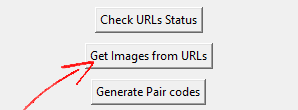

# Template

## 1. Export selected products from shoptet to excel

You will need code (kód produktu), pairCode, name (název produktu), and description (popis)

## 2. Get URL addresses of products

In the app paste URL addresses of category pages to input boxes and click **Get URLs** button. It will copy only visible produtcs

  
&nbsp; &nbsp; &nbsp; &nbsp;
  

It will create new excel file with names and urls named **shoptet_product.xlsx**.

### Optional

Now if you want to add hidden products you can add them manually (you can copy names from exported file from shoptet and use my template**template_generate_url.xlsx**). If you used template I suggest to use the next button **Check URL status**and it will check if URL adress exist. It will write to next column which are wrong. If every address is OK, no need to do anything.

Shopetet doesn't allow me to export URL of products so I used python code [data-scraper-URLS.py](CODE/data-scraper-URLS.py), where I put there category pages and code got URLS and titles of every product that was visible in those categories. Some products may be hidden. So add them manualy. I made the URLS in excel **template_generate_url.xlsx** (but not every URL is generated corectly) so after that I used [check_url_status.py](CODE/check_url_status.py) to check if every URL is valid and replaced invalid manually.

## 3. Get URLs of images

When you have all the addresses click button **Get images from URLs** and it will automatically paste them in next column in excel, be aware this step may take some time (usually around 60 seconds for 100 products/urls)

From URLs I got in previous step I needed one image for reference. So I used [url_of_images.py](CODE/url_of_images.py) to load URLs from excel to get URL of main image of the product and write it to next column

## 4. Generate pair codes

Now click button **Generate pair codes**. This will create pair codes same for different colour variants of the same product, but this **may need little manual adjustment**. It works fine if colour is in brackets for example: Road bike (green). But sometimes colour is written in the name differently, so it needs manual correction, for example: Road bike - Green.

## 5. Use generate HTML code

After you adjusted your pair codes just click **Generate HTML code** button and codes will be generated automatically.

Copy name, URL of product and URL of images (all 3 columns from shoptet_product.xlsx) and use **template_generate_variants** to generate html code. You will need to adjust **made up code** (works fine with colours in brackets), because sometimes color variant are distinguished differently

## 6. Merge exported file and template with HTML

Last step is to click **Generate import file** button, then select extracted file from shoptet and template file created by this app (shoptet_product.xlsx) and it will create excel file (for_import.xlsx) which you can directly import to shoptet.

  
&nbsp; &nbsp; &nbsp; &nbsp;
   
&nbsp; &nbsp; &nbsp; &nbsp;
  
&nbsp; &nbsp; &nbsp; &nbsp;
  

Use [template_to_import](CODE/template_to_import.py) to merge descriptions from both (it will put color variants to end of description)

## 7. Import Excel to shoptet

Import file to shoptet and you're good to go

Import excel file output_for_import.xlsx to shoptet and **chceck** Do not change products and variants that are not included in the imported file.(Neměnit produkty a varianty, které nejsou obsaženy v importovaném souboru.) and **check** Activate redirection for changed URLs to new ones.(Aktivovat přesměrování u změněných URL adres na nové.)
